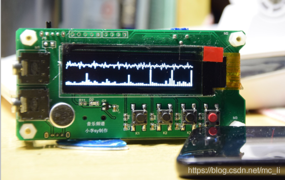
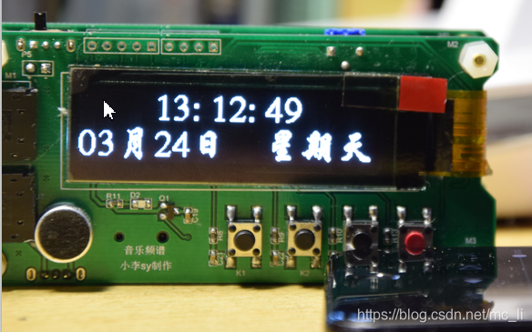

# FFT-25664音乐频谱简介

## 介绍
基于STM32F103实现的音乐频谱显示器

仅供学习交流使用

制作分享：https://blog.csdn.net/mc_li/article/details/88761087?spm=1001.2014.3001.5502

效果演示：https://www.bilibili.com/video/av47915539/

硬件：STM32F103C8T6、OLED25664

## 成品效果图

